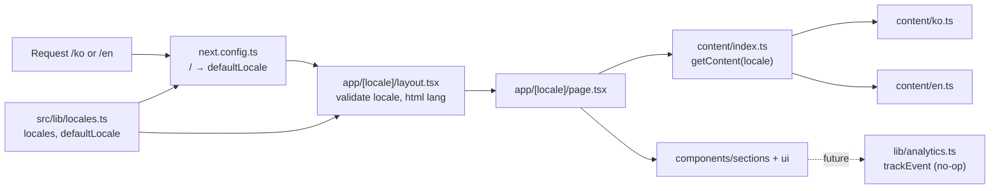

# Architecture

Phase 1 is a frontend-only site. There is no backend, database, auth, or payments. See [product-spec.md](product-spec.md) for features and [plan.md](plan.md) for scope.

## Tech stack

Versions as installed (`package.json` / `npm ls`):

| Tool                 | Version                                 |
| -------------------- | --------------------------------------- |
| Next.js (App Router) | 16.3.8                                  |
| React / React DOM    | 19.2.8                                  |
| TypeScript           | 5.9.3                                   |
| Tailwind CSS         | 4.3.3 (via `@tailwindcss/postcss`)      |
| ESLint               | 9.39.5 (`eslint-config-next` 16.3.8)    |
| Prettier             | 3.9.9 (`eslint-config-prettier` 10.1.8) |
| Package manager      | npm                                     |

Next.js 16 differs from older versions. See `AGENTS.md` and the docs bundled in `node_modules/next/dist/docs/` before writing framework code.

## Folder structure

```text
src/
  app/
    globals.css          Global styles (Tailwind)
    [locale]/            Routes for "ko" and "en"
      layout.tsx         Root layout: <html lang>, fonts, metadata
      page.tsx           Placeholder page showing the site title
  components/
    ui/                  Reusable primitives (empty for now)
    sections/            Page sections (empty for now)
  content/
    ko.ts, en.ts         All user-facing text per language
    index.ts             getContent(locale)
  lib/
    locales.ts           Supported locales and the default locale
    analytics.ts         No-op trackEvent() placeholder
docs/                    Product spec, architecture, plan
next.config.ts           Redirect from / to the default locale
```

## Locale routing and default language

- Supported locales (`ko`, `en`) and the default are defined in `src/lib/locales.ts`.
- `/` redirects (307, not permanent) to `/<defaultLocale>`. The redirect is set in `next.config.ts` and reads `defaultLocale`.
- `src/app/[locale]/layout.tsx` validates the locale (unknown values return 404), sets `<html lang>`, and pre-renders both locales with `generateStaticParams`.
- To change the default language, edit `defaultLocale` in `src/lib/locales.ts`. No i18n library is used yet.

## Content

- Each language has one file: `src/content/ko.ts` and `src/content/en.ts`. `en.ts` is typed against `ko.ts`, so a missing key is a type error.
- Pages call `getContent(locale)` from `src/content/index.ts` and render the result. Components must not hard-code user-facing text.
- Shared business data (e.g. store hours) should live in one module and be reused. It does not exist yet.

## Future integration points (not implemented)

- **Form submission service** for the Custom Order form: not implemented, service undecided.
- **Analytics:** `trackEvent(name, props)` in `src/lib/analytics.ts` is a no-op stub. No provider is connected.
- **CRM** (HubSpot) and automation (n8n): not implemented. Phase 2 / Later.

## Folder and data flow


